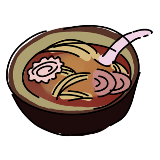

# umai



*Logo by [twitter.com/haggle](https://twitter.com/haggle)*

A [small](https://bundlephobia.com/package/umai) UI library with an ergonomic API.

## Install

```
npm install umai
```

## Usage

```js
import { m, mount } from 'umai';

let count = 1;

const App = () => (
  m('div',
    m('h1', `Count: ${count}`),
    m('button', { onclick: () => count += 1 }, 'increment')
  )
);

mount(document.body, App);
```

See [Examples](#examples).

### JSX

If you prefer JSX, you can configure your favorite compiler/bundler to transform `m` calls to JSX. For esbuild, set your compilerOptions to:

```json
{
  "compilerOptions": {
    "jsxFactory": "m",
    "jsxFragmentFactory": "'['"
  }
}
```

See [test/esbuild.js](./test/esbuild.js) for an example esbuild configuration.

In order to use JSX, the factory function (`m`) must be imported at the top of each of your JSX files.

```jsx
import { m } from 'umai'; // this is required to use JSX

const MyComponent = () => (
  <div>Hello, JSX!</div>
);
```

### Mounting

Use `mount` to mount your application on an element. `mount` takes two arguments:

1. An [Element](https://developer.mozilla.org/en-US/docs/Web/API/Element)
2. A stateless component (a function that returns a virtual DOM node)

```jsx
const el = document.getElementById('app');
const App = () => <p>hello world</p>;
mount(el, App);
```

### Components

`umai` components (stateless components) are functions that return pieces of your UI. Components accept an object of properties (`props`) as their first argument.

Below is an example of a `User` and a `List` component. The `User` component accepts a prop, `name`. In `List`, we pass different values for the `name` prop to different instances of `User` that we wish to display.

```jsx
const User = (props) => (
  <div class="user">
    <h2>{props.name}</h2>
  </div>
);

const List = () => (
  <div class="users">
    <User name="kevin" />
    <User name="rafael" />
    <User name="mike" />
  </div>
);
```

### Passing `children`
`children` are passed as part of the `props` object. They can be used to compose multiple components. This is especially helpful when creating layouts or wrapping styled elements.

```jsx
const Layout = ({ title, children }) => (
  <div class="container">
    <h1 class="page-title">{title}</h1>
    {children}
  </div>
);

const UserPage = () => (
  <Layout title="User Page">
    <p>Welcome to the user page!</p>
  </Layout>
);
```

### Redraws & State Management

`umai` uses global redraws by default. This means event handlers defined in your app will trigger full component tree re-renders. This simplifies state management so that any variable within the scope of your component is valid state.

```jsx
let input = '';
let todos = ['take out trash', 'walk the dog'];

const Todo = () => (
  <div>
    <input
      type="text"
      value={input}
      oninput={(ev) => input = ev.target.value}
    />

    <button onclick={() => { todos.push(input); input = ''; }}>
      add todo
    </button>

    <ul>
      {todos.map(todo =>
        <li>{todo}</li>
      }
    </ul>
  </div>
);
```

Triggering manual redraws is also possible using `redraw`. This is particularly helpful when dealing with effects or asynchronous code.

```jsx
import { m, redraw } from 'umai';
import { fetchUsers } from './api.js';

let users = [];

const getUsers = () => {
  fetchUsers()
    .then(res => users.push(res))
    .finally(redraw);
};

const Dashboard = () => (
  <div>
    {!users.length &&
      <p>There are no users!</p>
    }

    {users.length && users.map(user =>
      <p>{user.name}</p>
    )}

    <button onclick={getUsers}>
      Retrieve Users
    </button>
  </div>
);
```

### Stateful Components

To use local component state (like `useState` in React), you can create a stateful component. Stateful components are functions that return stateless components (or commonly known in [Mithril.js](https://mithril.js.org) as "closure components").

```jsx
const StatefulComponent = (initialProps) => {
  let localVariable = 'hello world';

  return (props) => (
    <div>
      {localVariable}
    </div>
  );
};
```

In the example above, the inner function (the stateless component) is run on every re-render, whereas the code before that (initializing `localVariable`) is only run once when the component mounts.

Here is the same Todo component from earlier, but as a stateful component. We can take advantage of `initialProps` to set the initial todos.

```jsx
const Todo = ({ initialTodos }) => {
  let input = '';
  let todos = [...initialTodos];

  return () => (
    <div>
      <input
        type="text"
        value={input}
        oninput={(ev) => input = ev.target.value}
      />

      <button onclick={() => { todos.push(input); input = ''; }}>
        add todo
      </button>

      <ul>
        {todos.map(todo =>
          <li>{todo}</li>
        }
      </ul>
    </div>
  );
};
```

Now that this component is stateful, I can mount multiple `Todo` components in my app, each containing their own state.

```jsx
const App = () => (
  <div>
    <Todo initialTodos={['walk the dog']} />
    <Todo initialTodos={['take out trash']} />
    <Todo initialTodos={['wash the car']} />
  </div>
);
```

### `dom` property

DOM nodes are passed to the `dom` handler immediately upon being created.

```jsx
const Description = () => (
  /* logs `p` Node to the console */
  <p dom={(node) => console.log(node)}>
    hello world
  </p>
);
```

You may optionally return a function that will be invoked upon Node removal.
```jsx
const Description = () => (
  <p dom={(node) => {
    console.log('created p node!');
    return () => console.log('removed p node!');
  }}>
    hello world
  </p>
);
```

When used with stateful components, the `dom` property may be used to store references to DOM elements (similar to `ref`/`useRef` in React). This is useful for third-party library integration.
```jsx
const Scrollbox = () => {
  let containerEl;

  return ({ loremIpsum }) => (
    <div dom={(node) => containerEl = node}>
      {loremIpsum}

      <button onclick={() => containerEl.scrollTop = 0;}>
        scroll to top
      </button>
    </div>
  );
};
```

### `onRemove` hook

You can trigger events when a stateful component parent node unmounts using the `onRemove` hook.

```jsx
import { m, onRemove } from 'umai';

const Field = () => {
  console.log('initialized Field!');

  onRemove(() => {
    console.log('unmounted Field!')
  });

  return () => (
    <div>
      ...
    </div>
  );
};
```

### Memoization

Memoization allows you to skip re-rendering a component if its props are unchanged between re-renders. `umai` provides a convenience utility for memoizing components using shallow equality checks.

```jsx
import { m, memo } from 'umai';

// User will not re-render if all props are strictly equal `===`
const User = memo((props) => (
  <div>
    {props.name}
  </div>
));
```

If you'd like more control over when to re-render, all components are passed their old props as a second argument. You can use this in conjunction with `m.retain` to return the old virtual DOM node.

```jsx
import { m } from 'umai';

const User = (props, oldProps) => {
  if (props.name === oldProps.name)
    return m.retain(); // return the old virtual DOM node

  return (
    <div>
      {props.name}
    </div>
  );
};
```

### Fragments

`umai` features minimal fragment support. There are two main caveats to keep in mind:
  * Keyed fragments are not supported
  * Components must return virtual DOM nodes.

```jsx
const Users = () => (
  <>
    <p>kevin<p>
    <p>rafael</p>
  </>
);

const App = () => (
  <div>
    {/* ✗ Not OK! umai components must return a virtual DOM node. */}
    <Users />
    
    {/* ✓ OK! A factory function that returns a fragment. */}
    {Users()}
  </div>
);
```

If you are using the hyperscript API (`m`), arrays are interpreted as fragments.

```jsx
const Users = () => [
  m('p', 'kevin'),
  m('p', 'rafael')
];

const App = () => (
  m('div',
    Users()
  )
);
```

### Class Utilities

Both `className` and `class` are valid properties when defining element classes. If both are present, `className` takes precedence.

#### Class String Builder

You may pass an object as an element class name where the keys correspond to CSS class names. `umai` will construct a class string based on the boolean values of each object property. This is helpful when conditionally applying CSS styles, and complements CSS Modules and utility CSS libraries nicely.

```jsx
const Modal = ({ isOpen = true }) => (
  <div class={{ 'modal--open': isOpen, 'bg-green': false, 'font-xl': true }}>
    ...
  </div>
);

// The above will render:
// <div class="modal--open font-xl">...</div>
```

#### Hyperscript Class Helper

If you are using the hyperscript API, you may append classes delimited with `.` as part of the element tag.

```js
const Todo = () => (
  m('div.todo.font-sm',
    '...'
  )
);

// The above will render:
// <div class="todo font-sm">...</div>
```

This can also be used with the class string builder to define classes that should always be present.

```js
const Modal = ({ isOpen = true }) => (
  m('div.font-xl', { class: { 'modal--open': isOpen, 'bg-green': false } },
    '...'
  )
);

// The above will render:
// <div class="modal--open font-xl">...</div>
```

## Examples

* [Counter](https://flems.io/#0=N4IgtglgJlA2CmIBcB2AbAOgCwCYA0IAZhAgM7IDaoAdgIZiJIgYAWALmLCAQMYD21NvEHIQAYT4BXQfABO3EKXgIebCAPJMADKhABfPDXqNmAK3K8BQkUwhgADn1lsABMBdg8HqYK8CASvBgfABu8C56LoSyfGAuAOSSYLQQAAJaGDgYWvEA3AA61IUIrvzSrgC8LloFRdT81KSuEuVyLlUAFACU7QB8Lh2FLh4d8VAQIfF4Q8Mj8SwAjFMuZYJd09SzcwBGkmxsAsvuAjywEDwA1kgDPRX9q64A1FULEV7xEPWyQcJs8V0zAHULq1QrBcodKB8HhJX4YbZ8KAATy8LRkshBCn4DhIcmQ1EksFgBCUKjUGlEaCQCwAnPpDCA6AxRBgeKQLCAGtY2KIEcjgMlZABzT5ILBaewADxctD2fFyyUlAFoAO7QNgsJBoACsEsluTO1HgSpY8AgQvY1IwaFyhCsStIEAAXvBqQAOKW5fiwJxIADEWEDuXstBgnyFSC0LgWer0fJRu32Ajwn3se2AdsESsI9BISKQwWofFIIZ48D0ClJ8FU6kaoh0CwAzNr9ABdPRAA)

* [Clock Example](https://flems.io/#0=N4IgtglgJlA2CmIBcB2AbAOgCwCYA0IAZhAgM7IDaoAdgIZiJIgYAWALmLCAQMYD21NvEHIQAYVh8eAa24hS8BDzYQB5JgAYkAVhABfPDXqNmAK3K8BQkUwhgADnwBObAATBXYPJ74BXQd5O8FBOtADurnquhE58YK4A5L5gtBAAAhoYOBgaCQDcADrURQhuKgyuALyJgA-ErqRstC4Q1ADmGB35RUUKbACSgvBOAG60sAAU4wCUVQB87kWuruXwVa7U8BEAIrRC0xhsfAAyUmPwACp28ADKbE4trdOF1EtBIeFPRQauAIwa-1NnkV+NQGq4JFJpGtpnNXONFp5xgkoBBhgk8AilmAkSwfujllcphiXq4pkVAd1qGA-IJxlApMlhGwMAAjPhQACe3ghMkBcn4DhIQ2Q1F8sFgBAUShUalEP20SBwAA59IYQHQGKIMDxSBYQCDrGxRGzOcAUk5Wi0kFgNPYAB6uWi+Q55FJ2gC0YWgbBYSDQ2ltdrysBa8HdLHgEFa7CQPwwaDyhCs7tIEAAXvBY0r7Xl+JInEgAMRYEt5ey0GAPJAaX6BvQmrks52Hah4Fr2Z3AJOCd2EegkDlIanUPikcs8eB6ORS+DKVSg0RaH4AZl0egAunogA)

* [htm + Stateful Component Example](https://flems.io/#0=N4IgtglgJlA2CmIBcA2ArAOjQJgDQgDMIEBnZAbVADsBDMRJEDACwBcxYR8BjAeytbwByEGzAACeAA86ABwRcQJeAm6sI-MowAMSAIx6QAX1zU6DJgCsyPfoOGMIYWbwBOrcWPEFXvCQHIxfwBuAB0qJxd3cWBxMFw43gBXAQTXeChXGgB3cSNvXwCksBoIAAFtDGwMbRDw8L4qEg8xWHEAXk92DAAjCCooAAowAEowqgbNDwBBWFgAYRpZEg7xQZGOgD4Y8PFxBA8ANxpYJPhV-zqqPd3xdNYk12v1ra6OAANbvYAeKAhDzZfPbib6yTYAFQAnrJziQ-Odsm4oCtWLxxCRmMlWEhvgB6MHA8T1a6EkH9WRJVhAwmsaHwdqhECCKRUkDU4HHU70gAkwE5ZyM7L2-HJlPavMGsVYNFcAHN4B4jBt2tt+edOtK5QqMGrBSTCbjAfrgezvsxsJteWqMKiAKqyGGuRbKdZGPHmo2EvF-AG3T5UIzjcJgZICQZQXjcYpCVi9XhQSEJF4qt6wf0-H2e4FmvSbAASKlgaMRrlgUAKfnExVK4gA1G8AITu3NA7682YLJYkfKG27e-5G95jRR8ZzEeCuZBUJJzfDKVTqTQiPS6ADMABZjKYQLR6CIMNwSDYQI17KwRD145DgCU5f0kOvtLIpOIaJTeMESlIALTZaCsZhUDQJ8pGCWB+ngb9mHgCBZTYfQMBQYICDsb8SAgAAveB9AADmfYI+CLVwkAAYnXcjglkGgYH6WUkG0cQV2fIxLwTXAekpVEqFwUVWGAFCBG-Ag6GISEkBDKheBIKjuHgIxFHneA1A0JoRF0PRVzQYwAF0jCAA)

* [3rd Party Library Integration](https://flems.io/#0=N4IgtglgJlA2CmIBcBWATAOgOwE4A0IAZhAgM7IDaoAdgIZiJIgYAWALmLCAQMYD21NvEHIQAZgBOUAAQAFWhLYBPaQBkIAIwkKVASUHwA5trYQB0gKIAPegAcE3EKXgIepgeSYAGJGKwgAXzwaekZmACtyXgEhESYIMFs+RWkAYRYFNmlCCT4waQBydjZbUiQAenL4UjAMUhZyngzFDEjy2gBXNj4CgG4AHWoEpJTgaTA8cb4OwUmJeChtAHdpAOzc-IKOsFoIAAEvDEwvPsHB-mpSLPTMgEFbW2kAXmkACgBKZ4A+aWBB6WkCCyTUyA2o-2kFyu0igtDYtGe0goEIBYyU8AUSGkaC8AEYACyTfgzNhYtBoVZ4FG-aTozHYvEoInTQRYsReSnUtEYiRkvEANmZJLJAA5OdQAQBdMEQqFZAQAWRZWRer2ofCg8E+Tx+fwlAMhzRV0mo8BWN0Uao18EmeoNBuUtngWIKGgUBSp+vtsPhWLt9oNsFoGhcZRhcNoGB2tleuRWOukcYwdIk709AYNPtozjYYeRXozv2phcBwZcLtuPAAjh0IKQIO5LtINCoUx7i4Ws1is1HaDG499E3wlhhiYJ3h37QFJ9JJR3pwWAu8wfbqfM2B0JBKPoP-faQS1NVdckoPiuDQuAQFzxD15vt9qfq9qWBXgUeLRqAA3bMemlQPIsUVZVJiuJQEBdFh4AgQx2CxfEvC8WwrF6ApVgnfVl0Ga8zmoMBlVeACeG2YQ2AwDQNSUSYdwTZ99VfAooAgL92wLV8LTYe5bAwgFPmkQZ3iw6hHH4RISHgCRkGoDpYFgIIQgYURR1IKIQAuWI2FECioCUYAdgkQwIGoJAEOQ6ROm6XodisABaJZoDYFgkH5FAkJQ2AjPgGyoJguDcQwflekIGIbPrAAvZ1cRFZDen4WBkiQABifEUt6WxaBgIzDCQDlcTcgJtKojQum6ag8CM2wumAYLBBswh6BIJQkHw9VSHSnh4ACRxnFcRtPBAHxcTEFBAklAIgA)

## Credits

`umai` is a hard fork of [hyperapp](https://github.com/jorgebucaran/hyperapp). Credit goes to all Hyperapp maintainers.

`umai` is heavily inspired by [Mithril.js](https://github.com/MithrilJS/mithril.js).
